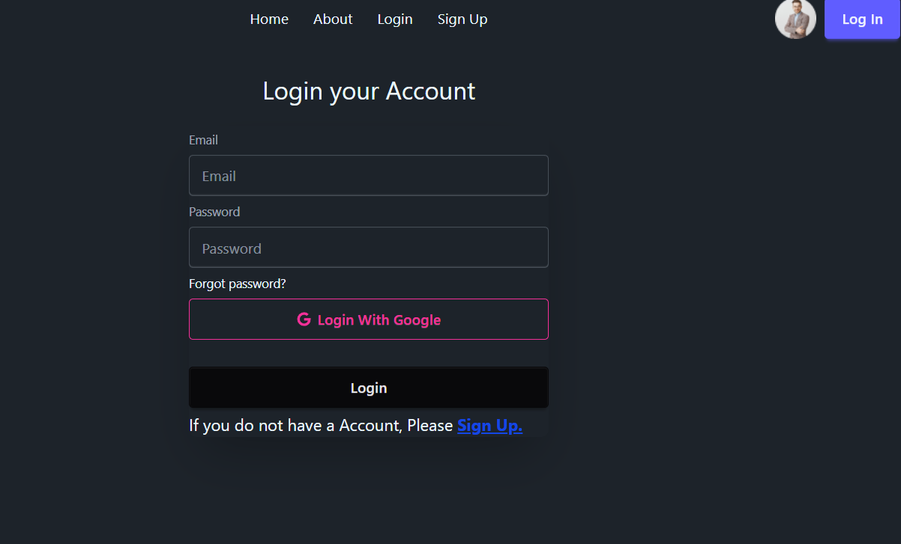
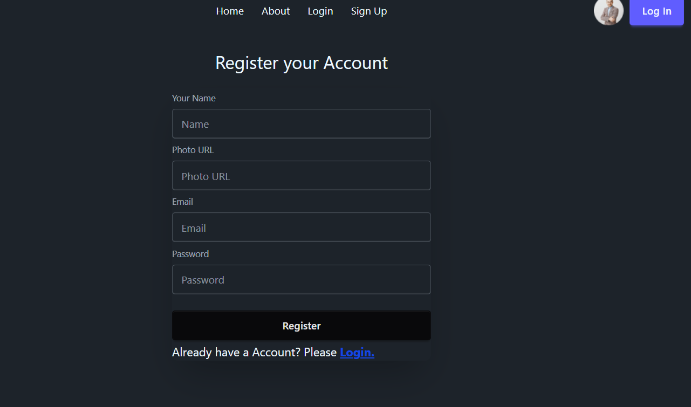

# Dragon News

Dragon News is a responsive web app delivering the latest news across multiple categories with a clean and user-friendly interface.

## Features

- **Responsive Design**  
  Seamlessly adapts to any device — mobile, tablet, or desktop.

- **User Authentication**  
  Secure login and signup with email/password and social sign-in options.

- **Real-Time News Updates**  
  Fetches and displays the latest news dynamically from an external API.

- **Category Browsing**  
  Browse news articles by categories like sports, technology, entertainment, and more.

- **Detailed News View**  
  Click articles to read full stories with detailed content.

## Screenshots

### 1. Home Page  
  
Displays the latest news highlights with category navigation on top for easy browsing.

### 2. Login Page  
  
Allows users to log in using email/password or social accounts for personalized experience.

### 3. Signup Page  
  
Enables new users to create an account with email/password or social sign-up options.

### 4. News Detail Page  
  
Provides full news article content, including images, descriptions, and source details.

## Live Demo

[https://dragon-news-auth-7b85e.web.app/](https://dragon-news-auth-7b85e.web.app/)

## Technologies Used

- React.js  
- Firebase Authentication  
- Firebase Hosting  
- Tailwind CSS

## Getting Started

Clone the repo, install dependencies, and run the app:

```bash
git clone https://github.com/yourusername/dragon-news.git
cd dragon-news
npm install
npm run dev
