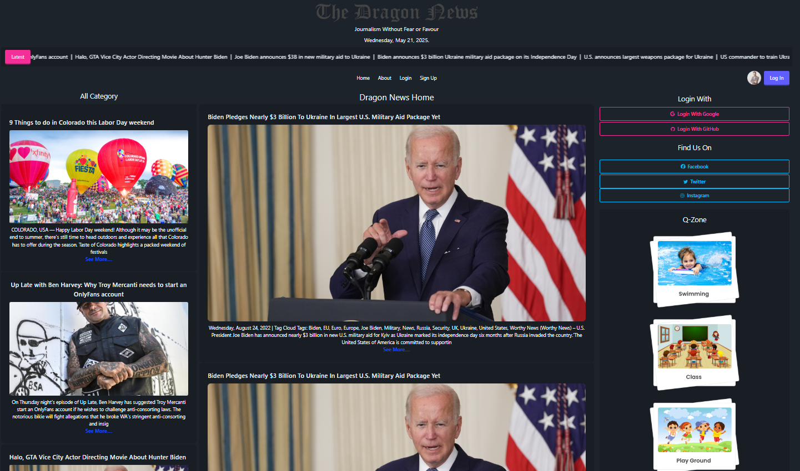

# Dragon News

  
  
  

**Dragon News**  is a responsive and dynamic news platform that provides the latest headlines through an intuitive user interface. Developed with modern web technologies, it features user authentication, category-based filtering, real-time news updates, and detailed article previews. The project is built with scalability and an emphasis on delivering a seamless user experience.

---

## ✨ Features

### 🧭 Responsive Design  
The entire UI is built using Tailwind CSS and React, ensuring that it adjusts seamlessly across all screen sizes—from desktop monitors to tablets and smartphones. This guarantees users a consistent and visually appealing experience regardless of the device.

### 🔐 User Authentication  
Users can securely sign up or log in using email and password. The app also supports social login (like Google), handled via Firebase Authentication. Once logged in, users can view restricted or personalized content.

### 🔄 Real-Time News Fetching  
News data is fetched from an external news API. Whenever new content is published, it's automatically reflected on the platform, eliminating the need for manual updates and ensuring users always see the latest articles.

### 🗂️ Category-Based Filtering  
The home page includes category links such as Politics, Sports, Business, Technology, and more. When a user selects a category, only the articles related to that topic are displayed. This enhances readability and user engagement.

### 📄 News Detail Page  
Users can click on any news card to view the complete article. The detail page displays a full-sized image, headline, source, author (if available), published time, and a full description. This feature mimics modern news websites and improves the reading experience.

### 👨‍💻 Clean Codebase & Modular Structure  
The project follows a modular folder structure for better maintainability. Components are reusable and well-organized, making it easy for future developers to navigate and scale the application.

---

## 📷 Screenshots


### 🏠 Home Page  
  
Displays trending articles from all categories in a clean grid layout. Navigation bar and category filter are accessible at the top.

---

### 🔐 Login Page  
  
Allows returning users to log in using email/password or Google. Firebase handles session storage securely.

---

### 📝 Signup Page  
  
New users can register with their credentials or quickly join using their Google account. The form includes validations and Firebase integration.

---


### 📖 News Detail Page  
  
Full article view with extended description, author info, and a source link. Enhances the user’s reading experience with a structured layout.

---

## 🚀 Live Demo

👉 [Click here to visit Dragon News](https://dragon-news-auth-7b85e.web.app/)

---
flowchart TD
    A[User opens Home Page] --> B{Is User Authenticated?}
    B -- No --> C[Browse Latest News]
    B -- Yes --> D[Access Personalized Features]
    C --> E[Select Category]
    D --> E
    E --> F[Fetch News from API]
    F --> G[Display List of Articles]
    G --> H[User selects an article]
    H --> I[Show News Detail Page]


## ⚙️ Technologies Used

| Technology      | Purpose                             |
|-----------------|-------------------------------------|
| React.js        | Frontend framework                  |
| Firebase Auth   | User authentication (email/Google) |
| Firebase Hosting| Deploy & host the live project     |
| Tailwind CSS    | Utility-first responsive UI         |
| React Router    | Page navigation and route protection|
| News API        | Provides dynamic news content       |

---

## 🛠️ Getting Started

To run this project locally:

```bash
# 1. Clone the repo
git clone https://github.com/yourusername/dragon-news.git

# 2. Move into the project directory
cd dragon-news

# 3. Install dependencies
npm install

# 4. Start the development server
npm run dev
